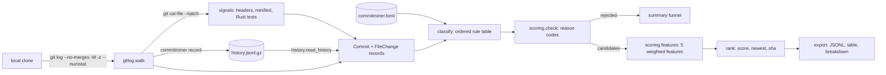

# CommitMiner

[](https://github.com/vipul21435/commitminer/actions/workflows/ci.yml)

Mine and rank candidate fail-to-pass tasks from real repository history, so task authors
spend time only on commits that can become good tasks.

A fail-to-pass task is built from a real fix: the tests added or changed by a commit fail on
the parent commit and pass on the fix. Most commits in a history cannot become such a task
(docs, CI, release bumps, refactors, test-only changes, huge features). CommitMiner walks the
history, classifies every changed file, drops the commits that cannot work (with a reason
code), and ranks the rest with a transparent score: each feature's value, weight and
contribution are printed and exported, so a reviewer can see why a commit ranked where it
did. The output is JSON Lines for downstream environment builders.

CommitMiner proposes and ranks. It does not build environments or run the tests; verifying
the flip is the downstream builder's job.

## What works today

- **History walker** over a local clone: one `git log --no-merges -M -z --numstat` call with
  a fixed environment and command-line config, parsed from NUL-separated output. Renames
  keep both paths, binary files have no line counts, and paths with spaces or non-UTF-8
  bytes parse exactly.
- **Record and replay**: `commitminer record` saves a walked history as deterministic JSON
  Lines (gzipped when the name ends in `.gz`); `commitminer mine --history` replays it
  through the same code path. Mining the live tomli clone and replaying its recording
  produce byte-identical JSONL (checked with `cmp`).
- **Multi-language file classifier**: one ordered table of 34 rules
  ([docs/rules.md](docs/rules.md), generated from the code) for Python, Rust,
  JavaScript/TypeScript, Go and Java. Each rule has an id, languages, a matcher (directory,
  file-name or path glob, or a content signal), a category (source, test, docs, config,
  generated, vendored, other) and a rationale; the first match wins and its id is reported.
  Path conventions include `__tests__/`, `*.test.ts`, `*.spec.js`, `*_test.go`,
  `src/test/java/`, Rust `tests/` and `benches/`, `vendor/`, `third_party/`,
  `node_modules/` and lockfiles. Every rule has positive and negative examples in a
  table-driven test, which fails when a rule has none.
- **Content signals**: generated-code headers (`Code generated ... DO NOT EDIT`,
  `@generated`), minified JavaScript (lines averaging 200+ characters) and Rust
  `#[cfg(test)]` modules. While mining a clone, every changed code file is read at its commit
  through one `git cat-file --batch` process; a Rust file whose `#[test]` count grew against
  the parent counts as a test change (`rust-tests-added`), so Rust fixes with inline tests
  become candidates. Signals are stored in recordings and exported per file.
- **`commitminer classify PATH...`** prints each path's category, the matching rule, the
  signals read from the file and every used rule's rationale (`--json` for machine output);
  **`commitminer rules`** prints the effective table in match order.
- **Per-repository overrides** in `commitminer.toml` at the repository root (or
  `--config`): custom rules checked before the built-in table, and built-in rules disabled
  by id. Unknown keys, categories, languages and signals are errors. See
  [examples/classify/commitminer.toml](examples/classify/commitminer.toml).
- **Candidate filter** with reason codes: `empty`, `no-source`, `source-unchanged` (source
  files only renamed), `no-test`, `too-large` (source+test lines over `--max-lines`).
  Generated and vendored files never count as source or test, nor toward the size.
- **Transparent scorer**: five features in `[0, 1]` times weights that add up to 10:
  `small_diff` (3), `test_lines_added` (3), `linked_reference` (2: closing keyword 1.0, bare
  `#123` 0.5), `fix_keyword` (1), `focused_source` (1). Ranked by score, then newest, then
  sha.
- **Export**: every candidate as one JSON object per line (base commit, fix commit, source,
  test and inline-test files, per-file category, rule and signals, line counts, feature
  breakdown), plus a terminal table and per-candidate contribution tables.
- **Offline demo** on the recorded history of [hukkin/tomli](https://github.com/hukkin/tomli)
  (MIT, 312 non-merge commits), bundled in [`examples/tomli/`](examples/tomli/) with its
  license and provenance. CI re-records it from GitHub on every push and checks it still
  matches byte for byte.
- **Docker image** on digest-pinned `python:3.12-slim` and `uv` bases, running as uid 10001,
  with `LABEL project=commitminer`.

## Quickstart

Needs git, [uv](https://docs.astral.sh/uv/) and make.

```sh
git clone https://github.com/vipul21435/commitminer && cd commitminer
make install    # uv sync --locked + pre-commit hook
make demo       # mine the bundled tomli history offline
make demo-classify   # classify the multi-language sample tree in examples/classify
uv run commitminer mine /path/to/a/clone --out out/candidates.jsonl
```

Verified in a fresh clone: `make install` took 1.38 s and the first `make demo` 0.64 s
(`/usr/bin/time -p`, warm uv cache, 8 GB Apple Silicon Mac).

## Usage

```text
commitminer mine [REPO] [--history FILE] [--rev REV] [--max-count N] [--max-lines 400]
                 [--test-lines-cap 40] [--top 10] [--explain 1] [--out FILE] [--repo-name NAME]
                 [--config FILE]
commitminer record REPO --out FILE [--rev REV] [--max-count N] [--repo-name NAME] [--url URL]
commitminer classify PATH... [--root DIR] [--config FILE] [--no-content] [--json]
commitminer rules [--root DIR] [--config FILE] [--markdown]
commitminer version
```

`mine` and `record` also take `--no-content` to skip reading file contents (path rules
only). `classify` paths are relative to `--root` (default: the current directory) and need
not exist; a path that is not a file there is classified by its path alone.

Output of `make demo` (the recorded tomli history, unedited):

```text
hukkin/tomli: walked 312 commits, 47 candidates, 265 rejected (no-source 142, source-unchanged 1, no-test 118, too-large 4)

rank   score  sha         date        lines  src  test  subject
   1    7.55  2a2aa62f1b  2026-01-10     60    1     5  TOML 1.1: Allow newlines and trailing comma in inline...
   2    7.44  948211d852  2021-06-05     75    1     8  FIX: Three odd cases
   3    7.16  5ab9ec926d  2021-05-28     62    1     1  NEW: Allow float parse func customisation (#2)
   4    6.62  8b962e1349  2022-01-29     18    1     1  Raise a friendly `TypeError` for wrong file mode (#175)
   5    6.50  27be26fa4d  2021-05-28     66    1    21  Require 100% test coverage
   6    6.39  b7e1bcccb9  2026-04-10     25    1     1  Use Python 3.15 lazy import (#295)
   7    6.35  149547d2ec  2024-11-27    113    2     2  Create binary wheels with mypyc (#242)
   8    6.16  b9cbbe27b5  2021-07-23     36    1     4  Add binary file object support to `load` (#103)
   9    6.11  d1d6a8571b  2024-11-11    182    1     1  Add attributes to TOMLDecodeError. Deprecate free-for...
  10    6.07  e1fdb94bc9  2026-03-25     28    1     1  Limit number of parts of a key (#286)

#1 2a2aa62f1b score 7.55: TOML 1.1: Allow newlines and trailing comma in inline tab...
  feature            value weight contrib  detail
  small_diff         0.850   3.00   2.550  60 of at most 400 source+test lines changed
  test_lines_added   1.000   3.00   3.000  47 test lines added (full value at 40)
  linked_reference   0.500   2.00   1.000  #200
  fix_keyword        0.000   1.00   0.000  no fix keyword in the subject
  focused_source     1.000   1.00   1.000  1 source file changed

wrote 47 candidates to out/tomli-candidates.jsonl
```

The first line of `out/tomli-candidates.jsonl`, pretty-printed and with the file lists cut
to two entries:

```json
{
  "base": "38297f82cd0ef067f1afd2ffb8dfa73b65c398da",
  "date": "2026-01-10T14:41:08+02:00",
  "features": [
    {"contribution": 2.55, "detail": "60 of at most 400 source+test lines changed", "name": "small_diff", "value": 0.85, "weight": 3.0},
    {"contribution": 3.0, "detail": "47 test lines added (full value at 40)", "name": "test_lines_added", "value": 1.0, "weight": 3.0},
    {"contribution": 1.0, "detail": "#200", "name": "linked_reference", "value": 0.5, "weight": 2.0},
    {"contribution": 0.0, "detail": "no fix keyword in the subject", "name": "fix_keyword", "value": 0.0, "weight": 1.0},
    {"contribution": 1.0, "detail": "1 source file changed", "name": "focused_source", "value": 1.0, "weight": 1.0}
  ],
  "files": [
    {"added": 6, "category": "source", "deleted": 4, "path": "src/tomli/_parser.py", "rule": "py-source"},
    {"added": 0, "category": "test", "deleted": 0, "old_path": "tests/data/valid/empty-inline-table.json", "path": "tests/data/valid/inline-table/empty-inline-table.json", "rule": "test-dir"}
  ],
  "inline_test_files": [],
  "lines": {"changed": 60, "source_added": 6, "source_deleted": 4, "test_added": 47, "test_deleted": 3},
  "rank": 1,
  "repo": "hukkin/tomli",
  "schema_version": 1,
  "score": 7.55,
  "sha": "2a2aa62f1bc71b89b74d41dd2ab67b5dd24bc129",
  "source_files": ["src/tomli/_parser.py"],
  "subject": "TOML 1.1: Allow newlines and trailing comma in inline tables (#200)",
  "test_files": ["tests/data/valid/inline-table/empty-inline-table.json", "tests/data/valid/inline-table/empty-inline-table.toml"]
}
```

### Classifying files

`make demo-classify` runs `classify` on [`examples/classify/`](examples/classify/), a tiny
original tree with one file per kind of rule and a `commitminer.toml` that adds a
`fixtures-dir` rule and disables the built-in `tooling-dir` rule (unedited output):

```text
category   rule               path
source     rust-inline-tests  src/lib.rs  [rust-inline-tests]
generated  generated-header   internal/kind/kind_string.go  [generated-header]
generated  minified-content   web/static/bundle.js  [minified]
test       js-test-file       web/src/app.test.ts
vendored   vendored-dir       vendor/github.com/acme/left/left.go
test       fixtures-dir       fixtures/percent.json
source     go-source          tools/cli/main.go
generated  lockfile           Cargo.lock *
docs       docs-file          README.md
* not a file under the root: classified by path only

rules used:
  rust-inline-tests  Rust source with an in-file #[cfg(test)] module: still source, but a commit can change its tests without touching tests/
  generated-header   a 'Code generated ... DO NOT EDIT', '@generated' or 'auto-generated' comment in the first 30 lines marks tool output
  minified-content   lines averaging 200+ characters: a minified bundle without a .min.js name
  js-test-file       Jest, Vitest, Mocha and Jasmine test file names
  vendored-dir       copies of other projects' code (Go and Rust vendor/, npm node_modules/); a change there, tests included, is not this project's fix
  fixtures-dir       this project keeps test inputs and expected outputs in fixtures/
  go-source          Go source
  lockfile           dependency lockfiles (Cargo.lock, yarn.lock, go.sum, uv.lock, ...) are written by the package manager
  docs-file          prose by extension (Markdown, reStructuredText, AsciiDoc, plain text)
```

### Rust and Go histories

Mining live clones of two small public repositories, [dtolnay/semver](https://github.com/dtolnay/semver)
at `280ebcb6ed` (Rust, inline `#[cfg(test)]` modules) and
[spf13/pflag](https://github.com/spf13/pflag) at `c966cfef47` (Go, `*_test.go`). These are
not bundled; the numbers come from `uv run commitminer mine <clone> --rev <sha>` on a fresh
`git clone`:

| Repository | Before this classifier (commit `a2226d2`) | `mine` | `mine --no-content` |
| --- | --- | --- | --- |
| dtolnay/semver, 572 commits | 0 candidates (all `no-source`) | 50 candidates | 18 candidates |
| spf13/pflag, 285 commits | 0 candidates (all `no-source`) | 97 candidates | 97 candidates |

32 of the 50 semver candidates change no test file at all: their tests were added inside
the fixed source file. The top one (the `test` column reads "0+1": no test file, one source
file with new `#[test]` functions):

```text
dtolnay/semver: walked 572 commits, 50 candidates, 522 rejected (no-source 203, no-test 314, too-large 5)

rank   score  sha         date        lines  src  test  subject
   1    6.95  55bf7fb619  2016-02-01      7    1   0+1  Fix bug with pre-release parsing
   2    6.09  a3b67d654d  2016-10-03     75    1     1  Parse deprecated versions.
   3    5.90  dfecd2a8a6  2015-12-04     13    1   0+1  Fix matching against any()
   4    5.88  4f271ff6a3  2015-11-28     16    1   0+1  deal with hyphens correctly
   5    5.86  2719cb6d47  2016-10-17     19    1   0+1  Bugfix for rust-lang/cargo#3202

#1 55bf7fb619 score 6.95: Fix bug with pre-release parsing
  feature            value weight contrib  detail
  small_diff         0.983   3.00   2.947  7 of at most 400 source+test lines changed
  test_lines_added   0.000   3.00   0.000  0 test lines added (full at 40); new #[test] in 1 src file
  linked_reference   1.000   2.00   2.000  Fixes #73
  fix_keyword        1.000   1.00   1.000  Fix
  focused_source     1.000   1.00   1.000  1 source file changed
```

`git show 55bf7fb619` confirms it: one changed line in `src/version_req.rs` plus a new
`#[test] fn test_pre()` in the same file's test module.

Docker (the image contains the recorded history and the sample tree, so this runs offline):

```sh
make docker   # build, run the demo inside the image, prune this project's dangling images
# Mine a clone on the host; -u keeps git's ownership check happy on Linux.
docker run --rm -u "$(id -u):$(id -g)" -v "$PWD:/repo:ro" commitminer:local mine /repo
```

## Architecture



| Module | Role |
| --- | --- |
| `models.py` | frozen dataclasses `Commit` and `FileChange` |
| `gitlog.py` | builds the git command, runs it with a fixed environment, parses the NUL-separated output; reads file contents for signals with `git cat-file --batch` |
| `history.py` | writes and validates recorded histories (JSONL, optional reproducible gzip) |
| `languages.py` | the six languages and extension detection |
| `signals.py` | content-signal detectors over file bytes |
| `classify.py` | the ordered rule table, glob matcher and `classify(path, rules, signals)` |
| `config.py` | `commitminer.toml` loading and validation |
| `ruletable.py` | `classify` and `rules` command output, `docs/rules.md` |
| `scoring.py` | per-category diff stats, filter, features, ranking |
| `export.py` | JSONL export and the terminal renderers |
| `cli.py` | Typer commands `mine`, `record`, `classify`, `rules`, `version` |

## Measured

| What | Command | Result |
| --- | --- | --- |
| Tests and coverage | `make cov` | 440 passed, 100.00% line and branch coverage (gate 90%) |
| Types | `make typecheck` | `mypy --strict`: no issues in 13 source files |
| Classifier table | `commitminer rules --markdown` | 34 rules, each with positive and negative examples in `tests/test_classify.py` |
| Demo funnel | `make demo` | 312 commits walked, 47 candidates, 265 rejected |
| Live walk of the tomli clone | `/usr/bin/time -p uv run commitminer mine <tomli clone> --top 0 --explain 0` | 0.25 s with content signals, 0.22 s with `--no-content` (3 runs each) |
| Live walk of the semver clone | same on dtolnay/semver (572 commits) | 0.31 s with content signals, 0.15 s with `--no-content` (3 runs each) |
| Replay of the recording | same with `--history examples/tomli/history.jsonl.gz` | 0.13 s (3 runs) |
| Live vs replay | `mine <clone> --repo-name hukkin/tomli --out a.jsonl`, `make demo`, `cmp` | identical |
| Recording size | `ls -l examples/tomli/history.jsonl.gz` | 63697 bytes (746733 uncompressed) |
| Recording integrity | `make verify-recording` (also in CI) | byte-identical to a fresh recording from GitHub, on macOS git 2.50 and on the Ubuntu CI runner |
| Image size | `docker image inspect commitminer:local --format '{{.Size}}'` | 110608913 bytes |

## Design decisions

- **One git call, NUL-separated.** The walker reads commit headers and numstat from a
  single `git log -z` stream. Commit messages cannot contain NUL, so each header field is
  one token, and numstat entries are self-delimiting, so a path can never be mistaken for a
  commit boundary. `--end-of-options` stops a revision from being read as an option.
- **Fixed git environment.** `LC_ALL=C`, no system or global config, no pager, and
  command-line overrides for `core.fsmonitor`, `log.showSignature` and `color.ui`, so
  neither user nor repository settings can change the output or run a hook. UTC dates are
  normalised to `+00:00` because git versions differ on printing `Z`.
- **Record once, replay everywhere.** Demos, the Docker image and CI mine a recorded
  history, so they are offline and reproducible; recordings have sorted keys and no
  timestamps, and gzip uses `mtime=0`. Recordings keep commit messages but not the author
  and committer fields.
- **Hard filter first, soft score second.** Commits that cannot become a fail-to-pass task
  are rejected with a reason code instead of getting a low score, so the funnel is
  auditable. A source change that is only a rename is rejected (`source-unchanged`): a
  new test has nothing to catch.
- **Linear, explainable score.** `score = sum(weight * value)` with values in `[0, 1]` and
  weights that sum to 10. No LLM and no learned model: every number in the output can be
  recomputed by hand from the feature details.
- **Size counts source and test lines only.** Changelog, docs and CI churn does not make a
  task harder, so it does not count against `--max-lines`.
- **One ordered rule table, first match wins.** Vendored copies come first (their tests are
  not this project's), then test directories (so golden files under `testdata/` stay test
  data even when they carry a generated header), generated files, test file names, the
  Java main source set (so a package directory like `com/example/` is not read as
  `examples/`), configuration, documentation, tooling, source, and last prose names such as
  `LICENSE` (so a module named `license.py` stays source). Every rule carries its rationale,
  and `docs/rules.md` is generated from the table and checked by a test.
- **Content signals at walk time.** Signals depend only on a file's bytes and language, not
  on the rule table, so they are computed once while walking, stored in the recording, and
  replayed; a `commitminer.toml` change needs no re-recording. Reading uses one
  `git cat-file --batch` process with one request in flight, so the pipes never fill.
- **Rust inline tests by counting, not guessing.** A Rust file with a `#[cfg(test)]` module
  is a test change only when its `#[test]` attribute count grew against the parent version,
  so ordinary code edits to such files do not pass the test filter.
- **Fresh repository, not a fork.** PyDriller (Apache-2.0) was considered; CommitMiner
  needs only a narrow, typed parse of `git log`, and calling the git CLI keeps the
  dependency set to Typer and `mypy --strict` clean. See [PLAN.md](PLAN.md).

## Known issues

- **Numstat-level signals only.** Without patch text the scorer cannot tell a real fix from
  a comment-only change. In the demo, #5 `27be26fa4d` ("Require 100% test coverage")
  changes `tomli/_parser.py` only by adding `# pragma: no cover` comments, so its new tests
  pass on the parent: a false positive. #7 `149547d2ec` is mostly a build change
  (`git show --numstat`: 103 of its 219 added lines are in the CI workflow). Hunk counts,
  comment-only detection and added-assertion counts are slice 2 in PLAN.md.
- **Inline Rust tests have no line count.** A Rust source file that gained `#[test]`
  functions satisfies the "changes tests" filter, but its lines count as source: without
  the patch, CommitMiner cannot split test lines from code lines, so `test_lines_added`
  stays 0 for such commits (slice 2 adds hunks).
- **Test-only Rust commits look like fixes.** For the same reason, a commit that only adds
  `#[test]` functions to a source file passes the filter: semver #7 `45323ea034` ("Add test
  to assert for issue 88") changes only its test module (`git show 45323ea034`), so there
  is no fix to flip.
- **Directory rules match any path component.** A Go or Python package directory named
  `tools`, `scripts`, `examples`, `docs` or `test` is classified by that directory rule
  (Java's `src/main/java/` is special-cased). Override with `commitminer.toml`.
- **Content limits.** Detection looks at the first 1 MiB of a file; paths containing a
  newline cannot be requested from `git cat-file --batch` and get no signals. Kotlin,
  C/C++ and other languages have no rules and fall back to `other`. A recording made with
  `record --no-content` has no signals, and replaying it cannot recover them.
- **Test data counts as test lines.** tomli keeps its cases as `.toml`/`.json` files under
  `tests/`; they count toward `test_lines_added`, which suits tomli but may overrate
  fixture-heavy commits elsewhere.
- **Weights are code defaults.** Only `--max-lines` and `--test-lines-cap` are exposed on
  the command line; `commitminer.toml` configures the classifier only so far.
- **English keywords only** for `fix_keyword` and closing references.
- **Docker and file ownership.** git refuses a repository owned by another user, and the
  walker deliberately ignores global config (so `safe.directory` cannot be set there);
  mining a bind-mounted clone on Linux needs `-u "$(id -u):$(id -g)"`.
- **No dedupe, no GitHub walker, no HTML report yet** (see Roadmap).

## Roadmap

Planned in [PLAN.md](PLAN.md), not built yet:

Slice 1 (the multi-language classifier) is done; the numbers below follow PLAN.md.

2. Patch-level difficulty features (hunks, cross-file edits, public API touched, added
   assertions), config-file weights and an `explain` command.
3. Patch fingerprints that ignore whitespace and renames, and a SQLite dedupe ledger
   across repositories, forks and cherry-picks.
4. GitHub merged pull-request walker with an ETag cache, rate-limit handling and recorded
   fixtures.
5. A versioned export schema (JSON Schema) and Markdown/HTML reports.
6. Multi-repository batch mining with incremental resume.

## Development

```sh
make check              # lint, typecheck, tests with the coverage gate
make verify-recording   # re-record tomli from GitHub and compare (network)
```

## License

MIT, see [LICENSE](LICENSE). The recorded tomli history in `examples/tomli/` comes from
tomli (MIT, Copyright (c) 2021 Taneli Hukkinen); its license is in
[examples/tomli/LICENSE](examples/tomli/LICENSE).
