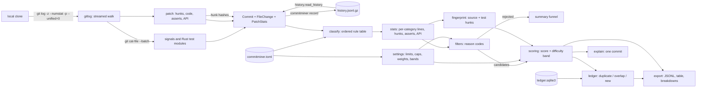

# CommitMiner

[](https://github.com/vipul21435/commitminer/actions/workflows/ci.yml)

Mine and rank candidate fail-to-pass tasks from real repository history, so task authors
spend time only on commits that can become good tasks.

A fail-to-pass task is built from a real fix: the tests added or changed by a commit fail on
the parent commit and pass on the fix. Most commits in a history cannot become such a task
(docs, CI, release bumps, refactors, comment edits, test-only changes, huge features).
CommitMiner walks the history, classifies every changed file, measures every file's patch,
drops the commits that cannot work (with a reason code), and ranks the rest with a
transparent score. A separate difficulty estimate puts each candidate in an easy, medium or
hard band. Each feature's value, weight and contribution are printed and exported, so a
reviewer can see why a commit ranked where it did. Every candidate gets a patch
fingerprint, and a shared SQLite ledger marks fixes that were already proposed: the same fix
in a fork, a cherry-pick, a re-indented or moved copy. The output is JSON Lines for
downstream environment builders.

CommitMiner proposes and ranks. It does not build environments or run the tests; verifying
the flip is the downstream builder's job.

## What works today

- **History walker** over a local clone: one streamed
  `git log --no-merges -M -z --numstat -p --unified=0` call with a fixed environment and
  command-line config (diff algorithm, inter-hunk context and indent heuristic pinned),
  parsed one commit at a time from NUL-separated output. Renames keep both paths, binary
  files have no line counts, and paths with spaces or non-UTF-8 bytes parse exactly. Each
  file's patch block is matched to its numstat entry and its line counts are checked.
- **Patch measurements per file** (Python, Rust, JavaScript/TypeScript, Go, Java): hunks;
  code hunks and code lines, leaving out blank lines, comment-only lines and hunks that
  only change comments or (outside Python) indentation; added assertion lines (`assert`,
  `assert_eq!`, `expect(`, `t.Errorf`, `assertEquals`, ...) net of identical deleted ones;
  public declarations touched (top-level `def`/`class` without a leading underscore,
  `pub` items, exported Go identifiers, `export`, `public`); and for Rust, the lines inside
  `#[cfg(test)]` modules, found with a small lexer that skips braces in comments, strings,
  raw strings and char literals. Those lines count as test lines, not source lines.
- **Record and replay**: `commitminer record` saves a walked history, measurements
  included, as deterministic JSON Lines (gzipped when the name ends in `.gz`);
  `commitminer mine --history` replays it through the same code path. Mining the live tomli
  clone and replaying its recording produce byte-identical JSONL (checked with `cmp`).
- **Multi-language file classifier**: one ordered table of 35 rules
  ([docs/rules.md](docs/rules.md), generated from the code) for Python, Rust,
  JavaScript/TypeScript, Go and Java. Each rule has an id, languages, a matcher (directory,
  file-name or path glob, or a content signal), a category (source, test, docs, config,
  generated, vendored, other) and a rationale; the first match wins and its id is reported.
  Every rule has positive and negative examples in a table-driven test, which fails when a
  rule has none. Java package directories below `src/<set>/java/` are not layout, so
  `com/shop/vendor/` is not vendored and junit5's `src/main/java/.../Test.java` is source.
  Globs are checked when a rule is built (a `/` in a directory or file-name pattern, an
  empty range such as `[z-a]`, an empty path segment are errors) and matched in linear time.
- **Content signals**: generated-code headers (`Code generated ... DO NOT EDIT`,
  `@generated`, or a comment that opens with "Auto-generated" or "This file was
  generated"; a comment that only mentions generated bindings does not count), minified
  JavaScript and Rust `#[cfg(test)]` modules, read through one
  `git cat-file --batch` process while walking. A Rust file whose `#[test]` count grew, or
  that gained lines inside its test modules, counts as a test change, so Rust fixes with
  inline tests become candidates.
- **Hard filters with reason codes**, checked in this order before any scoring: `empty`,
  `docs-only`, `generated-only` (generated or vendored files only), `no-source`,
  `source-unchanged` (renames, mode changes, binary files, or edits only inside Rust test
  modules), `source-cosmetic` (source changes touch only comments, blank lines or
  indentation), `no-test`, and `oversize` (more source+test lines than `--max-lines`, or
  more source files than `--max-source-files`).
- **Transparent score** that ranks candidates: six features in `[0, 1]` times weights that
  add up to 10: `small_diff` (3), `test_lines_added` (2), `added_assertions` (1),
  `linked_reference` (2: closing keyword 1.0, bare `#123` 0.5), `fix_keyword` (1),
  `focused_source` (1). Ranked by score, then newest, then sha.
- **Difficulty estimate** with an easy/medium/hard band, reported next to the score: five
  features whose weights add up to 10: `files` (1: source+test files), `hunks` (3: source
  code hunks), `lines` (3: source code lines), `cross_file` (2: source files with code
  changes beyond the first), `public_api` (1). Default bands: easy below 2, hard from 4.5.
- **`commitminer explain SHA`** for one commit, from a clone (`--repo`, any revision) or a
  recording (`--history`, sha prefix): the per-file table, the verdict with its reason code
  and meaning (and the broken limit for `oversize`), and for candidates both contribution
  tables with totals and the band thresholds. `--json` prints one object. Golden tests pin
  the explanations of fixed synthetic commits in all five languages.
- **`commitminer.toml`** at the repository root (or `--config`): classifier rules and
  disabled built-in rules, filter limits, feature caps, both weight sets and the band
  thresholds, with a strict schema (unknown keys, wrong types, negative weights and
  inverted bands are errors). Command-line limits win over the file. See
  [Configuration](#configuration).
- **`commitminer classify PATH...`** and **`commitminer rules`** show how paths are
  classified and the effective rule table.
- **Patch fingerprints**: every hunk of every walked patch gets a 64-bit hash of its
  changed lines with leading and trailing whitespace dropped, inner runs of whitespace
  collapsed and blank lines left out; the file path and the hunk's line numbers are not
  hashed. A candidate's fingerprint is its source and test hunk hashes, sorted, plus a patch
  hash over them, so a cherry-pick onto a shifted file, a re-indented copy and a renamed or
  moved file all get the same fingerprint, and a cherry-pick with a resolved conflict
  shares most of its hunks.
- **Dedupe ledger** (`commitminer ledger add|check|list`, `mine --ledger`): one SQLite file
  (standard library `sqlite3`, versioned schema) records proposed fixes by fingerprint with
  repository, sha, status, owner and first-seen time. A candidate is a `duplicate` (same
  patch hash), an `overlap` (shares at least `--min-overlap`, default 0.5, of the distinct
  hunks of the smaller fix), or `new`. Adding is one `BEGIN IMMEDIATE` transaction backed by
  a unique constraint on the fingerprint, so two authors cannot claim the same fix;
  checking never writes and also compares the candidates of one run with each other.
- **Export**: every candidate as one JSON object per line (schema version 3: base commit,
  fix commit, source, test and inline-test files, per-file category, rule, signals and
  patch measurements, line counts, public API touched, score and difficulty breakdowns,
  fingerprint, and the ledger verdict with its matches), plus a terminal table and
  per-candidate contribution tables.
- **Offline demo** on the recorded history of [hukkin/tomli](https://github.com/hukkin/tomli)
  (MIT, 312 non-merge commits), bundled in [`examples/tomli/`](examples/tomli/) with its
  license and provenance. CI re-records it from GitHub on every push and checks it still
  matches byte for byte.
- **Docker image** on digest-pinned `python:3.12-slim` and `uv` bases, running as uid 10001,
  with `LABEL project=commitminer`.

## Quickstart

Needs git, [uv](https://docs.astral.sh/uv/) and make.

```sh
git clone https://github.com/vipul21435/commitminer && cd commitminer
make install        # uv sync --locked + pre-commit hook
make demo           # mine the bundled tomli history offline
make demo-explain   # explain one candidate and one rejected tomli commit
make demo-classify  # classify the multi-language sample tree in examples/classify
make demo-ledger    # claim upstream fixes, then find them again in a release branch and a fork
uv run commitminer mine /path/to/a/clone --out out/candidates.jsonl --ledger team.sqlite3
uv run commitminer ledger add team.sqlite3 out/candidates.jsonl --sha <sha> --owner <name>
uv run commitminer explain <sha> --repo /path/to/a/clone
```

Verified in a fresh clone of `cd8b012`: `make install` took 2.08 s, the first `make demo`
0.67 s and `make demo-ledger` 1.11 s (`/usr/bin/time -p`, warm uv cache, 8 GB Apple
Silicon Mac).

## Usage

```text
commitminer mine [REPO] [--history FILE] [--rev REV] [--max-count N] [--max-lines N]
                 [--max-source-files N] [--test-lines-cap N] [--top 10] [--explain 1]
                 [--out FILE] [--repo-name NAME] [--config FILE] [--no-content]
                 [--ledger FILE [--min-overlap 0.5] [--new-only]]
commitminer ledger add LEDGER CANDIDATES.jsonl [--sha SHA]... [--top N] [--owner NAME]
                       [--status claimed|proposed] [--min-overlap 0.5] [--allow-overlap]
commitminer ledger check LEDGER CANDIDATES.jsonl [--min-overlap 0.5] [--json]
commitminer ledger list LEDGER [--repo NAME] [--json]
commitminer explain SHA [--repo DIR | --history FILE] [--max-lines N] [--max-source-files N]
                    [--test-lines-cap N] [--config FILE] [--no-content] [--json]
commitminer record REPO --out FILE [--rev REV] [--max-count N] [--repo-name NAME] [--url URL]
commitminer classify PATH... [--root DIR] [--config FILE] [--no-content] [--json]
commitminer rules [--root DIR] [--config FILE] [--markdown]
commitminer version
```

`--no-content` skips reading file contents: classification uses path rules only and Rust
test modules are not found (their lines count as source). Patches are always measured.
`classify` paths are relative to `--root` (default: the current directory) and need not
exist; a path that is not a file there is classified by its path alone. A ledger file is
created (empty, with its schema) the first time any command opens it. `ledger add` exits
with 1 when it refused a candidate and `ledger check` when a candidate is not new, so
scripts can tell that a fix was already taken.

Output of `make demo` (the recorded tomli history, unedited). `diff` is the difficulty and
its band; the ranking uses only the score:

```text
hukkin/tomli: walked 312 commits, 44 candidates (easy 15, medium 17, hard 12), 268 rejected (docs-only 42, no-source 100, source-unchanged 1, source-cosmetic 6, no-test 115, oversize 4)

rank   score         diff  sha         date        lines  src  test  subject
   1    6.88    4.74 hard  5ab9ec926d  2021-05-28     62    1     1  NEW: Allow float parse func customisation...
   2    6.64  3.42 medium  948211d852  2021-06-05     75    1     8  FIX: Three odd cases
   3    6.57    0.74 easy  8b962e1349  2022-01-29     18    1     1  Raise a friendly `TypeError` for wrong fi...
   4    6.55  2.10 medium  2a2aa62f1b  2026-01-10     60    1     5  TOML 1.1: Allow newlines and trailing com...
   5    6.45    6.34 hard  149547d2ec  2024-11-27    113    2     2  Create binary wheels with mypyc (#242)
   6    6.29    7.20 hard  d1d6a8571b  2024-11-11    182    1     1  Add attributes to TOMLDecodeError. Deprec...
   7    6.13    0.71 easy  4e245a4bbb  2024-10-02     16    1     1  `tomli.loads`: Raise TypeError not Attrib...
   8    6.09    7.20 hard  67ec7d1052  2021-06-02    168    1     1  NEW: Print line and column in error messa...
   9    6.08  2.88 medium  b9cbbe27b5  2021-07-23     36    1     4  Add binary file object support to `load` ...
  10    6.06    0.53 easy  b7e1bcccb9  2026-04-10     25    1     1  Use Python 3.15 lazy import (#295)

#1 5ab9ec926d score 6.88, difficulty 4.74 (hard): NEW: Allow float parse func customisation (#2)
  score
    feature            value weight contrib  detail
    small_diff         0.845   3.00   2.535  62 of at most 400 source+test lines changed
    test_lines_added   0.875   2.00   1.750  35 test lines added (full value at 40)
    added_assertions   0.600   1.00   0.600  3 assertion lines added in tests (full value at 5)
    linked_reference   0.500   2.00   1.000  #2
    fix_keyword        0.000   1.00   0.000  no fix keyword in the subject
    focused_source     1.000   1.00   1.000  1 source file changed
    total                     10.00   6.885
  difficulty
    feature            value weight contrib  detail
    files              0.200   1.00   0.200  2 source+test files changed (full value at 10)
    hunks              1.000   3.00   3.000  10 source code hunks (full value at 10)
    lines              0.180   3.00   0.540  18 source code lines changed (full value at 100)
    cross_file         0.000   2.00   0.000  1 source file with code changes (full value at 5)
    public_api         1.000   1.00   1.000  def loads
    total                     10.00   4.740

wrote 44 candidates to out/tomli-candidates.jsonl
```

The first line of `out/tomli-candidates.jsonl`, with each feature and file on one line and
the file lists cut to the source and test file (the commit also changes `CHANGELOG.md` and
`README.md`). The fingerprint covers the 13 hunks of those two files; `ledger` is `null`
because the demo mines without `--ledger`:

```json
{
  "base": "37a543b74bb1633478aea9f3a6a450a550bdeb63",
  "date": "2021-05-28T23:10:06+02:00",
  "difficulty": {"band": "hard", "value": 4.74, "features": [
    {"contribution": 0.2, "detail": "2 source+test files changed (full value at 10)", "name": "files", "value": 0.2, "weight": 1.0},
    {"contribution": 3.0, "detail": "10 source code hunks (full value at 10)", "name": "hunks", "value": 1.0, "weight": 3.0},
    {"contribution": 0.54, "detail": "18 source code lines changed (full value at 100)", "name": "lines", "value": 0.18, "weight": 3.0},
    {"contribution": 0.0, "detail": "1 source file with code changes (full value at 5)", "name": "cross_file", "value": 0.0, "weight": 2.0},
    {"contribution": 1.0, "detail": "def loads", "name": "public_api", "value": 1.0, "weight": 1.0}
  ]},
  "features": [
    {"contribution": 2.535, "detail": "62 of at most 400 source+test lines changed", "name": "small_diff", "value": 0.845, "weight": 3.0},
    {"contribution": 1.75, "detail": "35 test lines added (full value at 40)", "name": "test_lines_added", "value": 0.875, "weight": 2.0},
    {"contribution": 0.6, "detail": "3 assertion lines added in tests (full value at 5)", "name": "added_assertions", "value": 0.6, "weight": 1.0},
    {"contribution": 1.0, "detail": "#2", "name": "linked_reference", "value": 0.5, "weight": 2.0},
    {"contribution": 0.0, "detail": "no fix keyword in the subject", "name": "fix_keyword", "value": 0.0, "weight": 1.0},
    {"contribution": 1.0, "detail": "1 source file changed", "name": "focused_source", "value": 1.0, "weight": 1.0}
  ],
  "files": [
    {"added": 35, "category": "test", "deleted": 6, "patch": {"api": ["def test_parse_float"], "asserts": 3, "code_added": 33, "code_deleted": 6, "code_hunks": 3, "hunks": 3, "test_added": 0, "test_deleted": 0}, "path": "tests/test_misc.py", "rule": "test-dir"},
    {"added": 13, "category": "source", "deleted": 8, "patch": {"api": ["def loads"], "asserts": 0, "code_added": 10, "code_deleted": 8, "code_hunks": 10, "hunks": 10, "test_added": 0, "test_deleted": 0}, "path": "tomli/_parser.py", "rule": "py-source"}
  ],
  "fingerprint": {"hunks": ["2238f1a042c06dea", "281157c378695ed6", "2d98fd8039a500da", "31087633dc36ca60", "42dc602a455f1507", "5a92b41459e49fb7", "66717315e93d09ff", "785747b132e589e7", "82c818dedf502363", "e1a9b9c9fabab1f0", "f1fa33414ce49364", "f2fac2deb39097db", "fa350b2a3bba7f1b"], "patch": "f10c534e4424fd9b", "version": 1},
  "inline_test_files": [],
  "ledger": null,
  "lines": {"changed": 62, "source_added": 13, "source_deleted": 8, "test_added": 35, "test_deleted": 6},
  "public_api": ["def loads"],
  "rank": 1,
  "repo": "hukkin/tomli",
  "schema_version": 3,
  "score": 6.885,
  "sha": "5ab9ec926d9dc1ef79e66215edd51285371fe8a0",
  "source_files": ["tomli/_parser.py"],
  "subject": "NEW: Allow float parse func customisation (#2)",
  "test_files": ["tests/test_misc.py"]
}
```

### Explaining one commit

`commitminer explain` shows how one commit was measured and judged. The file table lists,
per file, the numstat lines, hunks, code hunks (hunks that change code), lines inside Rust
test modules, and added assertion lines. From `make demo-explain` (unedited):

```text
$ commitminer explain 948211d852 --history examples/tomli/history.jsonl.gz
commit   948211d852a62ab78b20bae5d288f882822ca14f
base     bc1048993c13c8942e5cdf3faaf904453fa89416
date     2021-06-05T01:34:14+03:00
subject  FIX: Three odd cases
verdict  candidate: score 6.64 of 10, difficulty 3.42 of 10 (medium)
patch    fingerprint 3cbcfe3f86d6105c (16 source and test hunks)

  files
    category  rule               added   del hunks  code tests asserts  path
    config    build-config           9     9     2     2     0       0  .pre-commit-config.yaml
    docs      docs-file              7     0     1     1     0       0  CHANGELOG.md
    test      test-dir               4     0     1     1     0       0  tests/data/extras/invalid/array-of-tables/overwrite-array-in-parent.toml
    test      test-dir               3     0     1     1     0       0  tests/data/extras/invalid/table/redefine-1.toml
    test      test-dir               3     0     1     1     0       0  tests/data/extras/invalid/table/redefine-2.toml
    test      test-dir              11     0     1     1     0       0  tests/data/extras/valid/array/array-subtables.json
    test      test-dir               7     0     1     1     0       0  tests/data/extras/valid/array/array-subtables.toml
    test      test-dir               6     0     1     1     0       0  tests/data/extras/valid/array/open-parent-table.json
    test      test-dir               3     0     1     1     0       0  tests/data/extras/valid/array/open-parent-table.toml
    test      test-dir               8     0     2     2     0       1  tests/test_misc.py
    source    py-source             27     3     7     6     0       0  tomli/_parser.py

  score (ranks candidates)
    feature            value weight contrib  detail
    small_diff         0.812   3.00   2.438  75 of at most 400 source+test lines changed
    test_lines_added   1.000   2.00   2.000  45 test lines added (full value at 40)
    added_assertions   0.200   1.00   0.200  1 assertion line added in tests (full value at 5)
    linked_reference   0.000   2.00   0.000  no issue or pull-request reference
    fix_keyword        1.000   1.00   1.000  FIX
    focused_source     1.000   1.00   1.000  1 source file changed
    total                     10.00   6.638

  difficulty (easy < 2 <= medium < 4.5 <= hard)
    feature            value weight contrib  detail
    files              0.900   1.00   0.900  9 source+test files changed (full value at 10)
    hunks              0.600   3.00   1.800  6 source code hunks (full value at 10)
    lines              0.240   3.00   0.720  24 source code lines changed (full value at 100)
    cross_file         0.000   2.00   0.000  1 source file with code changes (full value at 5)
    public_api         0.000   1.00   0.000  no public declaration changed
    total                     10.00   3.420
```

The same command on `27be26fa4d` ("Require 100% test coverage", ranked 5th before patches
were measured) now prints:

```text
verdict  rejected (source-cosmetic): source changes touch only comments, blank lines or (outside Python) indentation
```

Its three source hunks only add `# pragma: no cover` comments (`git show --unified=0
27be26fa4d -- tomli/_parser.py`), so its new tests pass on the parent.

### Configuration

Everything the filter, the score and the difficulty use can be set per repository in
`commitminer.toml` (every key is optional; these are the defaults):

```toml
[filter]
max_lines = 400          # source+test lines
max_source_files = 10

[score]
test_lines_cap = 40      # added test lines for the full test_lines_added value
assertions_cap = 5

[score.weights]
small_diff = 3.0
test_lines_added = 2.0
added_assertions = 1.0
linked_reference = 2.0
fix_keyword = 1.0
focused_source = 1.0

[difficulty]
files_cap = 10
hunks_cap = 10
lines_cap = 100
cross_file_cap = 4
medium_at = 2.0          # difficulty 0-10: easy < medium_at <= medium < hard_at <= hard
hard_at = 4.5

[difficulty.weights]
files = 1.0
hunks = 3.0
lines = 3.0
cross_file = 2.0
public_api = 1.0
```

The `[classify]` table adds and disables classifier rules; see
[examples/classify/commitminer.toml](examples/classify/commitminer.toml). When a config is
used, `mine` and `explain` print one line saying what it changes, for example
`config: commitminer.toml: 0 custom rules, 0 built-in rules disabled, 3 scoring settings`.

### Classifying files

`make demo-classify` runs `classify` on [`examples/classify/`](examples/classify/), a tiny
original tree with one file per kind of rule and a `commitminer.toml` that adds a
`fixtures-dir` rule and disables the built-in `tooling-dir` rule (unedited output):

```text
category   rule               path
source     rust-inline-tests  src/lib.rs  [rust-inline-tests]
generated  generated-header   internal/kind/kind_string.go  [generated-header]
generated  minified-content   web/static/bundle.js  [minified]
test       js-test-file       web/src/app.test.ts
vendored   vendored-dir       vendor/github.com/acme/left/left.go
test       fixtures-dir       fixtures/percent.json
source     go-source          tools/cli/main.go
generated  lockfile           Cargo.lock *
docs       docs-file          README.md
* not a file under the root: classified by path only

rules used:
  rust-inline-tests  Rust source with an in-file #[cfg(test)] module: still source, but a commit can change its tests without touching tests/
  generated-header   a comment in the first 30 lines says this file is tool output ('Code generated ... DO NOT EDIT', '@generated', or opening with 'Auto-generated'); one that only mentions generated code does not count
  minified-content   lines averaging 200+ characters: a minified bundle without a .min.js name
  js-test-file       *.test.* and *.spec.* file names (Jest, Vitest, Mocha, Jasmine) next to the code
  vendored-dir       copies of other projects' code (Go and Rust vendor/, npm node_modules/); a change there, tests included, is not this project's fix
  fixtures-dir       this project keeps test inputs and expected outputs in fixtures/
  go-source          Go source
  lockfile           dependency lockfiles (Cargo.lock, yarn.lock, go.sum, uv.lock, ...) are written by the package manager
  docs-file          prose by extension (Markdown, reStructuredText, AsciiDoc, plain text)
```


### Rust and Go histories

Mining live clones of two small public repositories, [dtolnay/semver](https://github.com/dtolnay/semver)
at `280ebcb6ed` (Rust, inline `#[cfg(test)]` modules) and
[spf13/pflag](https://github.com/spf13/pflag) at `c966cfef47` (Go, `*_test.go`). These are
not bundled; the numbers come from `uv run commitminer mine <clone> --rev <sha>` (and with
`--no-content`) on a fresh `git clone`:

| Repository | Before slice 1 (`a2226d2`) | Slice 1 (`1cc6ca9`) | Slice 2 (`0c0112a`) | Now | Now, `--no-content` |
| --- | --- | --- | --- | --- | --- |
| dtolnay/semver, 572 commits | 0 candidates | 50 | 68 | 66 (easy 27, medium 21, hard 18) | 16 |
| spf13/pflag, 285 commits | 0 candidates | 97 | 92 | 92 (easy 41, medium 34, hard 17) | 92 |

In slice 2, semver gained 22 candidates: Rust fixes that edit an existing inline test
without adding a `#[test]` count as changing tests. It lost 4 whose only source edits are
inside test modules (`source-unchanged`). pflag lost 5: two comment or formatting-only
commits (`source-cosmetic`) and three that change 14 to 17 source files (`oversize`).
Since then semver lost the two candidates whose only "source" file was the Cargo build
script: `c41ab5af3a` ("Delete no_track_caller configuration", `build.rs` -7 lines) and
`d2a5e41d4a` ("Backport test suite to rustc <1.46", `build.rs` +6); `build.rs` outside
`src/` is now config, like `setup.py`. 50 of the 66 change no test file at all: their tests
live in the fixed source file. The semver top 5 (the `test` column "0+1" means no test
file, one source file with changed inline tests):

```text
dtolnay/semver: walked 572 commits, 66 candidates (easy 27, medium 21, hard 18), 506 rejected (docs-only 24, no-source 184, source-unchanged 18, source-cosmetic 44, no-test 229, oversize 7)

rank   score         diff  sha         date        lines  src  test  subject
   1    7.41    0.46 easy  5e87530d55  2020-07-22     26    1   0+1  fix tests and formatting to comply with #196
   2    7.40    0.46 easy  55bf7fb619  2016-02-01      7    1   0+1  Fix bug with pre-release parsing
   3    6.94    7.70 hard  0faefa8679  2015-10-29    208    2   0+1  Implement comparison for pre-release tags.
   4    6.81    0.64 easy  2719cb6d47  2016-10-17     19    1   0+1  Bugfix for rust-lang/cargo#3202
   5    6.78    0.43 easy  4f271ff6a3  2015-11-28     16    1   0+1  deal with hyphens correctly
```

`55bf7fb619` with its one-line fix and its new test split apart:

```text
commit   55bf7fb61956504cc9e5019a9e85d3ce83ca246b
base     33087a0fb4f3e40270bd7bf37d156cc19de6bbcb
date     2016-02-01T13:53:25-05:00
subject  Fix bug with pre-release parsing
verdict  candidate: score 7.40 of 10, difficulty 0.46 of 10 (easy)
patch    fingerprint 389bad59ed820ca5 (2 source and test hunks)

  files
    category  rule               added   del hunks  code tests asserts  path
    source    rust-inline-tests      6     1     2     1     5       1  src/version_req.rs

  score (ranks candidates)
    feature            value weight contrib  detail
    small_diff         0.983   3.00   2.947  7 of at most 400 source+test lines changed
    test_lines_added   0.125   2.00   0.250  5 test lines added (full value at 40), in #[cfg(test)] of 1 src file
    added_assertions   0.200   1.00   0.200  1 assertion line added in tests (full value at 5)
    linked_reference   1.000   2.00   2.000  Fixes #73
    fix_keyword        1.000   1.00   1.000  Fix
    focused_source     1.000   1.00   1.000  1 source file changed
    total                     10.00   7.397

  difficulty (easy < 2 <= medium < 4.5 <= hard)
    feature            value weight contrib  detail
    files              0.100   1.00   0.100  1 source+test file changed (full value at 10)
    hunks              0.100   3.00   0.300  1 source code hunk (full value at 10)
    lines              0.020   3.00   0.060  2 source code lines changed (full value at 100)
    cross_file         0.000   2.00   0.000  1 source file with code changes (full value at 5)
    public_api         0.000   1.00   0.000  no public declaration changed
    total                     10.00   0.460
```

`git show 55bf7fb619` confirms it: one changed line in `src/version_req.rs` plus a new
`#[test] fn test_pre()` in the same file's test module. `45323ea034` ("Add test to assert
for issue 88"), ranked 7th before, only adds a test to that module and is now rejected as
`source-unchanged`.

### Dedupe ledger

`make demo-ledger` builds two small repositories with fixed dates
([examples/ledger/build_repos.py](examples/ledger/build_repos.py), an original toy duration
parser), so the shas below are the same on every machine. `upstream` has two fixes on
`main` and a `release` branch that adds license headers to the parser (every line moves
down), cherry-picks fix A cleanly, adds a fix of its own, and cherry-picks fix B with a
conflict on the `UNITS` line resolved by hand. `fork` is an independent copy that
re-indented the code with two spaces, applied fix A, moved the package to `lib/`, applied
fix B there, and added a fix of its own. The demo mines `upstream` (3 candidates), claims
them for `alice`, then mines the release branch and the fork against the ledger (unedited
output from the `ledger add` step on; the dates are the day it ran):

```text
added    #1 demo/durations 536d6c4adf  claimed
added    #2 demo/durations 0287bf15bc  claimed
added    #3 demo/durations a4320cdcff  claimed
3 added, 0 refused: .commitminer/ledger-demo/ledger.sqlite3
demo/durations: walked 5 commits, 4 candidates (easy 4), 1 rejected (source-cosmetic 1)
ledger .commitminer/ledger-demo/ledger.sqlite3: 1 new, 2 duplicate, 1 overlap
  #1 b7894eea9b duplicate: same fix as demo/durations 536d6c4adf (claimed by alice on 2026-09-29)
  #3 352f6038e7 overlap: 2 of 3 hunks shared with demo/durations 0287bf15bc (claimed by alice on 2026-09-29)
  #4 a4320cdcff duplicate: already in the ledger (claimed by alice on 2026-09-29)

rank   score         diff  sha         date        lines  src  test  ledger   subject
   1    7.67    0.92 easy  b7894eea9b  2025-03-02     11    1     1  dup      Reject numbers without a unit (fixes #7)
   2    7.36    0.56 easy  69dbcfede3  2025-03-07      6    1     1  new      Accept upper-case units (fixes #11)
   3    7.34    0.92 easy  352f6038e7  2025-03-04      8    1     1  overlap  Accept days and weeks (fixes #9)
   4    4.36    1.95 easy  a4320cdcff  2025-03-01     25    1     1  dup      Add duration parser
demo/durations-fork: walked 5 commits, 4 candidates (easy 4), 1 rejected (source-unchanged 1)
ledger .commitminer/ledger-demo/ledger.sqlite3: 1 new, 3 duplicate
  #2 e275649a9e duplicate: same fix as demo/durations 536d6c4adf (claimed by alice on 2026-09-29)
  #3 6dbfaa8121 duplicate: same fix as demo/durations a4320cdcff (claimed by alice on 2026-09-29)
  #4 287f42b780 duplicate: same fix as demo/durations 0287bf15bc (claimed by alice on 2026-09-29)

rank   score         diff  sha         date        lines  src  test  ledger   subject
   1    7.36    0.56 easy  92ee5dce6f  2025-03-14      6    1     1  new      Allow spaces between parts (fixes #3)
   2    4.67    0.92 easy  e275649a9e  2025-03-11     11    1     1  dup      Reject numbers without a unit
   3    4.36    1.95 easy  6dbfaa8121  2025-03-10     25    1     1  dup      Import durations with two-space indentation
   4    4.34    0.92 easy  287f42b780  2025-03-13      8    1     1  dup      Accept days and weeks
.commitminer/ledger-demo/ledger.sqlite3: 3 entries (schema version 1)
first seen  status    owner       repo                sha         hunks  fingerprint       subject
2026-09-29  claimed   alice       demo/durations      536d6c4adf      3  d3c6af7bc86c6f62  Reject numbers without a unit (fixes #7)
2026-09-29  claimed   alice       demo/durations      0287bf15bc      3  c282f61bc585bf9b  Accept days and weeks (fixes #9)
2026-09-29  claimed   alice       demo/durations      a4320cdcff      2  7842e726a4b52616  Add duration parser
```

The cherry-pick of fix A and the fork's re-indented and moved copies are duplicates; the
cherry-pick with a resolved conflict keeps 2 of its 3 hunks and is an overlap; the
maintenance branch's and the fork's own fixes are new. The release branch's shared root
commit is "already in the ledger", and the fork's rename-only commit is rejected
(`source-unchanged`) before the ledger is asked. `ledger add` on the same file again refuses
all three and exits with 1.

On real histories the in-run check finds two pairs among 202 candidates (`mine <clone>
--ledger <empty file>`): semver's `dcfb5efdea` (`Revert "Revert "Implement comparison for
pre-release tags.""`) shares 45 of its 46 hunks with `0faefa8679`, the change it re-lands;
pflag's `13e924deb5` ("fix bug of string_slice with square brackets") shares 1 of 2 hunks
with `b027180f68` ("Fix square bracket handling in string_array"): the same one-line fix
(`sval = sval[1 : len(sval)-1]`) in two files, with different tests. Eleven more pairs
(one in tomli, three in semver, seven in pflag) share exactly one hunk, at most a quarter of
the smaller fix, and stay new under the default `--min-overlap 0.5`. No two candidates have
the same patch hash, and every candidate of the three histories has a fingerprint.

Docker (the image contains the recorded history and the sample tree, so this runs offline):

```sh
make docker   # build, run the demo inside the image, prune this project's dangling images
docker run --rm commitminer:local explain 948211d852 --history examples/tomli/history.jsonl.gz
# Mine a clone on the host; -u keeps git's ownership check happy on Linux.
docker run --rm -u "$(id -u):$(id -g)" -v "$PWD:/repo:ro" commitminer:local mine /repo
```

## Architecture



| Module | Role |
| --- | --- |
| `models.py` | frozen dataclasses `Commit`, `FileChange` and `PatchStats` |
| `gitlog.py` | builds the git command, streams and parses the NUL-separated output, matches patches to numstat; reads file contents for signals with `git cat-file --batch` |
| `patch.py` | `--unified=0` patch parser, per-language comment, assertion and declaration rules, Rust test-module lexer |
| `history.py` | writes and validates recorded histories (JSONL, optional reproducible gzip) |
| `languages.py` | the six languages and extension detection |
| `signals.py` | content-signal detectors over file bytes |
| `globs.py` | glob syntax, pattern checks, linear-time component and path matching |
| `classify.py` | the ordered rule table, Java package-directory handling and `classify(path, rules, signals)` |
| `config.py` | `commitminer.toml` loading and validation |
| `settings.py` | limits, caps, weights and band thresholds with their defaults |
| `stats.py` | per-category measurements of one commit |
| `filters.py` | hard filters and reason codes |
| `scoring.py` | score and difficulty features, ranking |
| `fingerprint.py` | hunk hashes (whitespace, path and position insensitive) and commit fingerprints |
| `ledger.py` | the SQLite ledger: schema and migrations, verdicts, atomic claims, reading exported candidates |
| `export.py` | JSONL export and the terminal renderers |
| `explain.py` | the `explain` output, text and JSON |
| `ruletable.py` | `classify` and `rules` command output, `docs/rules.md` |
| `cli.py` | Typer commands `mine`, `explain`, `record`, `classify`, `rules`, `ledger add/check/list`, `version` |

## Measured

| What | Command | Result |
| --- | --- | --- |
| Tests and coverage | `make cov` | 752 passed, 100.00% line and branch coverage (gate 90%) |
| Types | `make typecheck` | `mypy --strict`: no issues in 21 source files |
| Classifier table | `commitminer rules --markdown` | 35 rules, each with positive and negative examples in `tests/test_classify.py` |
| Demo funnel | `make demo` | 312 commits walked, 44 candidates (easy 15, medium 17, hard 12), 268 rejected |
| Live walk of the tomli clone | `/usr/bin/time -p uv run commitminer mine <tomli clone> --top 0 --explain 0` | 0.39 to 0.42 s with content signals, 0.37 s with `--no-content` (3 runs each; 0.35 s and 0.33 s before fingerprints and the glob matcher) |
| Live walk of the semver clone | same on dtolnay/semver (572 commits) | 0.63 to 0.66 s with content signals, 0.36 s with `--no-content` (3 runs each) |
| Live walk of the pflag clone | same on spf13/pflag (285 commits) | 0.32 s (3 runs) |
| Replay of the recording | same with `--history examples/tomli/history.jsonl.gz` | 0.17 s (3 runs; 0.16 s before, 0.21 s before the plain-component precheck) |
| One explanation | `uv run commitminer explain 55bf7fb619 --repo <semver clone>` | 0.10 s (3 runs) |
| Mining against a ledger | semver walk with `--ledger` holding its 66 candidates | 0.66 to 0.67 s (3 runs): 65 duplicate, 1 overlap |
| Checking an export | `uv run commitminer ledger check <that ledger> <semver export>` | 0.08 s (3 runs) |
| Concurrent claims | `tests/test_ledger.py`: 8 threads, 8 connections, one fix | exactly 1 added, 7 refused |
| Live vs replay | `mine <clone> --repo-name hukkin/tomli --out a.jsonl`, `make demo`, `cmp` | identical |
| Recording size | `ls -l examples/tomli/history.jsonl.gz` | 125311 bytes (1043013 uncompressed) with hunk hashes; 67715 before them, 63697 before patch measurements |
| Recording integrity | `make verify-recording` (also in CI) | byte-identical to a fresh recording from GitHub |
| Image size | `docker image inspect commitminer:local --format '{{.Size}}'` | 110897309 bytes |

## Design decisions

- **One git call, NUL-separated and streamed.** The walker reads commit headers, numstat
  and the patch from a single `git log -z` stream, one commit at a time, so memory stays
  flat. Commit messages cannot contain NUL, so each header field is one token; numstat
  entries are self-delimiting; patch text has no NUL (git treats such files as binary), so
  a commit's whole patch is one token whose file blocks come in numstat order. Each block
  is checked against its numstat counts, so a misread is an error, not a wrong number.
  `--end-of-options` stops a revision from being read as an option.
- **Fixed git environment.** `LC_ALL=C`, no system or global config, no pager, and
  command-line overrides for `core.fsmonitor`, `log.showSignature`, `color.ui`, the diff
  algorithm, inter-hunk context and indent heuristic, so neither user nor repository
  settings can change the output or run a hook (a test sets `diff.interHunkContext`,
  `diff.algorithm`, `diff.noprefix` and `diff.context` and gets the same hunks). UTC dates
  are normalised to `+00:00` because git versions differ on printing `Z`.
- **Hunks read by count.** With `--unified=0` every hunk is deleted lines then added lines,
  and the header gives both counts, so a content line such as `+++ x` is never mistaken for
  a header.
- **Measurements at walk time, text never stored.** Patch measurements depend only on the
  patch, the language and (for Rust test modules) the file contents, not on the rule table
  or weights, so they are computed while walking and stored in the recording in a compact
  form (fields equal to their defaults are left out). A `commitminer.toml` change needs no
  re-recording; a change to the measurement rules does, and CI's byte-for-byte
  re-recording check catches a stale bundled recording.
- **Cosmetic means provably cosmetic.** A hunk counts as code unless its deleted and added
  code lines are the same sequence after dropping comments and blank lines and, outside
  Python, surrounding whitespace. Whitespace inside a line is kept: semver's `5e87530d55`
  changes `"{} {}"` to `"{}{}"`, a real behaviour change. Hunks are compared one at a time,
  so moving a statement to another place still counts as a change.
- **Record once, replay everywhere.** Demos, the Docker image and CI mine a recorded
  history, so they are offline and reproducible; recordings have sorted keys and no
  timestamps, and gzip uses `mtime=0`. Recordings keep commit messages but not the author
  and committer fields.
- **Hard filters first, soft score second.** Commits that cannot become a fail-to-pass task
  are rejected with a reason code instead of getting a low score, so the funnel is
  auditable, and `explain` names the reason for any single commit.
- **Two linear models, both explainable.** The score (what to look at first) and the
  difficulty (how much work the fix is) are separate sums of `weight * value` with values
  in `[0, 1]` and default weights that sum to 10. Difficulty does not change the ranking:
  a task author may want hard tasks, easy ones, or a mix. No LLM and no learned model:
  every number can be recomputed by hand from the feature details.
- **Difficulty measures the fix, not the tests.** Hunks, lines, cross-file spread and public
  API are counted on source code only; the tests are what grades the task.
- **Size counts source and test lines only.** Changelog, docs and CI churn does not make a
  task harder, so it does not count against `--max-lines`.
- **One ordered rule table, first match wins.** Vendored copies come first (their tests are
  not this project's), then test directories (so golden files under `testdata/` stay test
  data even when they carry a generated header), generated files, test file names,
  configuration, documentation, tooling, source, and last prose names such as `LICENSE`
  (so a module named `license.py` stays source). Every rule carries its rationale, and
  `docs/rules.md` is generated from the table and checked by a test.
- **Java packages are not layout.** Below a Maven or Gradle source root (`src/<set>/java/`)
  directories are package names, so directory rules skip them: `com/shop/vendor/` is not
  vendored and `org/springframework/test/` is not a test tree. Test class names
  (`*Test.java`, `Test*.java`) do not count under `src/main/`, which Maven compiles as main
  code (junit5's own `Test.java` is source), while an `examples/` module above the source
  root is still tooling.
- **Rust inline tests by measuring, not guessing.** A Rust file with a `#[cfg(test)]`
  module is a test change when its `#[test]` count grew or lines inside the module were
  added; lines inside the module are test lines, the rest are code. A commit whose only
  source edits are inside test modules is rejected (`source-unchanged`).
- **Fingerprints ignore what copies change, not what fixes change.** Leading and trailing
  whitespace is dropped and inner runs are collapsed (re-indentation, tabs, realigned
  columns), but a space where there was none still counts. Removing all whitespace was
  tried first: semver's top candidate `5e87530d55` changes `"{} {}"` to `"{}{}"`, and it
  was left with nothing to hash. Only source and test hunks count, because a fork or a
  backport usually has its own changelog and CI edits.
- **Hunk hashes are measurements.** Like the other patch measurements they are computed
  while walking and stored in recordings (64 bits per hunk; the tomli recording grew from
  67715 to 125311 bytes), so replay needs no patch text. Their absence in an old recording
  means "unknown", never "no hunks".
- **Check in memory, claim in one transaction.** `mine --ledger` and `ledger check` copy the
  ledger into memory with SQLite's backup API and add each checked candidate to the copy,
  so duplicates inside one run and against the ledger are found by the same query and the
  shared file is never written. `ledger add` checks and inserts inside `BEGIN IMMEDIATE`,
  and `UNIQUE (fingerprint)` and `UNIQUE (repo, sha)` refuse a second claim even from a
  writer that skipped the check.
- **Fresh repository, not a fork.** PyDriller (Apache-2.0) was considered; CommitMiner
  needs only a narrow, typed parse of `git log`, and calling the git CLI keeps the
  dependency set to Typer and `mypy --strict` clean. See [PLAN.md](PLAN.md).

## Known issues

- **Build changes still look like fixes.** #5 in the demo, `149547d2ec` ("Create binary
  wheels with mypyc"), is mostly a build change (`git show --numstat 149547d2ec`: 103 of
  its 219 added lines are in the CI workflow); its source edits are real code, so no filter
  drops it.
- **Line-based heuristics, no syntax tree.** Python docstrings count as code; a line inside
  a `/* ... */` comment that does not start with `*` counts as code; a trailing comment
  after a string that opens a multi-line literal is kept. All of these err towards "code",
  so they can keep a cosmetic commit, not drop a real one.
- **Public API by naming convention.** Python counts only top-level `def`/`class` without a
  leading underscore, in any module: tomli's `_parser.py` is private by name but its
  `loads` is re-exported, and its `DEPRECATED_DEFAULT` class counts too. Methods, Go struct
  fields, Java interface methods without `public`, and re-exports are not followed. At most
  32 names are kept per file.
- **Assertion patterns are framework lists.** Custom helpers count only when named
  `assert_*` (Python, Rust); others (Go helpers such as `checkEqual(t, ...)`, Jest
  matchers without `expect(`) do not. tomli's data-driven tests add TOML/JSON cases with no
  assertion lines, so they get 0 for `added_assertions`.
- **Band thresholds are judgment calls.** The defaults (easy below 2, hard from 4.5) were
  chosen so a one-file fix of up to 3 hunks and 20 code lines with its test is easy (1.7)
  and a public-API change over three source files, 5 hunks and 40 lines is hard (5.1),
  then checked against the spread on tomli,
  semver and pflag (easy 15/28/41, medium 17/22/34, hard 12/18/17). They are not calibrated
  against how often agents solve such tasks. Hunk-heavy commits rank as hard even when each
  hunk is one line (`5ab9ec926d` threads one parameter through 10 hunks).
- **Rust test modules need contents.** With `--no-content`, or in a recording made with it,
  lines inside `#[cfg(test)]` modules count as source code, so semver drops from 68 to 18
  candidates. Detection looks at the first 1 MiB of a file.
- **Content limits.** Paths containing a newline cannot be requested from
  `git cat-file --batch` and get no signals. Kotlin, C/C++ and other languages have no
  rules and fall back to `other`; their patches are measured without comment rules.
- **Test data counts as test lines.** tomli keeps its cases as `.toml`/`.json` files under
  `tests/`; they count toward `test_lines_added`, which suits tomli but may overrate
  fixture-heavy commits elsewhere.
- **Recordings go stale when measurement rules change.** A recording stores measurements,
  not patch text; after changing `patch.py`, re-record (CI's re-recording check fails until
  the bundled one is refreshed).
- **English keywords only** for `fix_keyword` and closing references.
- **Directory rules match any path component.** A Go or Python package directory named
  `tools`, `scripts`, `examples`, `docs` or `test` is classified by that directory rule
  (Java package directories below `src/<set>/java/` are skipped). Override with
  `commitminer.toml`.
- **Docker and file ownership.** git refuses a repository owned by another user, and the
  walker deliberately ignores global config (so `safe.directory` cannot be set there);
  mining a bind-mounted clone on Linux needs `-u "$(id -u):$(id -g)"`.
- **Fingerprints are textual.** The same fix written differently (other variable names, a
  formatter that adds spaces around operators) gets other hunk hashes; hunk boundaries come
  from git's diff, so a cherry-pick onto code that changed around the fix can split or
  merge hunks and share fewer of them. Hunks that only change whitespace are left out.
- **Overlap counts hunks, not lines.** A one-line hunk weighs as much as a 40-line one:
  pflag's `13e924deb5` and `b027180f68` apply the same one-line fix to two files with
  different tests and are reported as overlapping (1 of 2 hunks) at the default 0.5; raise
  `--min-overlap` to ignore such pairs.
- **The ledger's repository is a label.** `--repo-name` (or the directory name) is stored,
  not a URL, so one repository mined under two labels counts as two (its fixes still collide
  by fingerprint). Statuses are `proposed` and `claimed`; there is no command yet to change
  a status or release a claim.
- **SQLite locking on network drives.** Concurrent claims rely on SQLite's file locks,
  which some network filesystems do not implement correctly; the concurrency test runs on a
  local disk.
- **No GitHub walker, no HTML report yet** (see Roadmap).

## Roadmap

Planned in [PLAN.md](PLAN.md), not built yet (slices 1 to 3 are done):

4. GitHub merged pull-request walker with an ETag cache, rate-limit handling and recorded
   fixtures.
5. A versioned export schema (JSON Schema) and Markdown/HTML reports.
6. Multi-repository batch mining with incremental resume.

## Development

```sh
make check              # lint, typecheck, tests with the coverage gate
make verify-recording   # re-record tomli from GitHub and compare (network)
UPDATE_GOLDEN=1 uv run pytest tests/test_explain.py   # refresh the explain golden files
```

## License

MIT, see [LICENSE](LICENSE). The recorded tomli history in `examples/tomli/` comes from
tomli (MIT, Copyright (c) 2021 Taneli Hukkinen); its license is in
[examples/tomli/LICENSE](examples/tomli/LICENSE).
